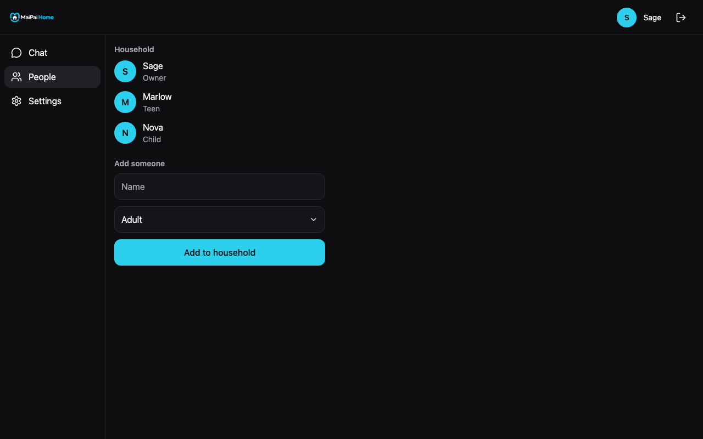

<p align="center">
  <picture>
    <source media="(prefers-color-scheme: dark)" srcset="https://raw.githubusercontent.com/getmaipai/.github/main/brand/maipai-home-logo-dark.png">
    
  </picture>
</p>

<h3 align="center">A private, self-hosted AI hub for families.</h3>

<p align="center"><a href="docs/dev.md">Documentation</a> · <a href="https://github.com/getmaipai/home/releases">Releases</a></p>

Your own AI, music, videos, podcasts, maps, books, and more, on your own
hardware, online or offline, for protection, privacy, and independence.
Nothing leaves your house.

<p align="center">
  
</p>

## Features

- **Chat**: talk with your own AI, running entirely on your hardware.
- **People**: a real household roster with PIN/password sign-in per person,
  including kid-safe profiles that need no password at all.
- **Settings**: household preferences like conversation retention and
  language, changed live, no restart.

## Getting started

No packaged installer yet: MaiPai Home is pre-alpha and only runs from
source today. With [Bun](https://bun.sh) installed:

```
git clone https://github.com/getmaipai/home.git
cd home && bun install
cd frontend && bun run build && cd ../backend && bun run start
```

The hub listens on `http://localhost:8787`. The first person who signs in
becomes the household owner.

## Status

Pre-alpha. The shell, sign-in, a household roster, Chat, and basic
settings are real and running end to end, verified in a real browser
against the real backend - but nothing is deployed to a real household
yet, and Chat answers with a placeholder until you point it at a real
local model. See [docs/dev.md](docs/dev.md) for exactly what's built and
what's deliberately deferred.

## Development

See [docs/dev.md](docs/dev.md) for the design record and the current
step-0 checklist. `scripts/check.sh` runs the pinned `@maipai/standards`
core; it needs a sibling checkout of `getmaipai/.github`.

---

MaiPai is open-source software for personal, self-hosted, non-commercial
use by you and your household. It is not affiliated with, endorsed by, or
sponsored by any platform it can connect to. All product names and
trademarks belong to their respective owners. You are responsible for
complying with the terms and laws that apply to you and the services you
access.

Licensed under [AGPL-3.0](LICENSE).
