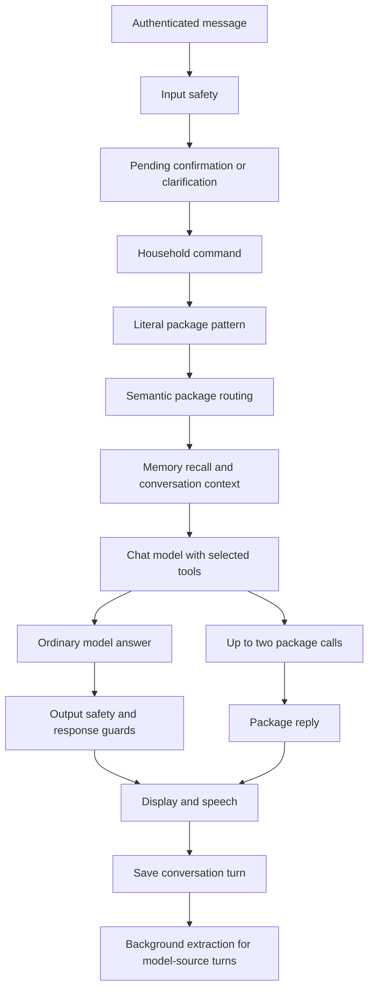

# Chat system analysis, 2026-09-07

Home has most of the necessary components, but they do not yet behave as
one consistent conversational system. The largest opportunity is to improve
how routing, context, memory, package execution, and response checks work
together. A larger model or a longer prompt would still encounter several
of the same failures.

## Scope and evidence

This report preserves the read-only review of checkout `02e802b`. It covers
intent recognition, automatic package calls, memory capture and use,
conversation history, persona, speech, scheduling, and evaluation. Sources
were the executable backend/frontend paths, shared spec, platform plan
chapters 4.3 through 4.5, and the current development notes. It is a dated
analysis, not a claim that these findings remain open after implementation.

Verification performed during the review:

| Suite | Files | Passed | Failed |
|---|---:|---:|---:|
| Backend turn, routing, memory, history, guard, persona, and API tests | 11 | 472 | 0 |
| Frontend chat adapter, history, chip, and memory-action tests | 4 | 35 | 0 |
| Shared voice and speech-normalization tests | 2 | 51 | 0 |
| Total | 17 | 558 | 0 |

The backend command was `bun test tests/turnEngine.test.ts tests/tier2.test.ts tests/routing.test.ts tests/routingCorpus.test.ts tests/memory.test.ts tests/memoryJudge.test.ts tests/conversationHistory.test.ts tests/guards.test.ts tests/turnActivity.test.ts tests/persona.test.ts tests/openai.test.ts` from `backend/`.
The frontend command was `bun test src/apps/chat/chatModelAdapter.test.ts src/apps/chat/chatHistoryAdapter.test.ts src/apps/chat/chatMemoryChip.test.tsx src/apps/chat/chatMemoryActions.test.ts` from `frontend/`.
The speech command was `bun test tests/ts/voice.test.ts tests/ts/speechNormalize.test.ts` from `spec/`.

Direct synthetic calls to the current guard reproduced the failures below.
Those probes test the guard, not a live model's likelihood of producing each
answer. No real household credentials or conversations were inspected to
establish the findings. Live inference latency and generated audio were not
remeasured. No project files were changed during the analysis itself.

Implementation work is tracked only in [BACKLOG.md](../BACKLOG.md#chat-system-optimization).
The decisions that turn these findings into fixed work orders live in
[dev.md](../dev.md#chat-system-optimization-decisions-2026-09-07).

## The current turn pipeline

The browser sends the latest message and conversation ID to
`POST /api/turn/stream`. The server reconstructs prior context from saved
conversation turns. Earlier stages can finish the request before later
ones run.

The central implementation is
[turnEngine.ts](../../backend/src/lib/turnEngine.ts). A directly routed
package does not reach the ordinary chat prompt, automatic recall, or
ordinary model-answer checks.

## 1. Intent recognition is a sequence of routing decisions

Home does not produce one explicit understanding of the entire message,
such as a personal disclosure plus a search request. It attempts pending
interaction resolution, household commands, literal package patterns,
semantic example matching, native tool selection, and ordinary conversation
in that order.

Semantic routing uses a 0.75 threshold and a 0.08 margin. Direct semantic
execution requires arguments that can be supplied deterministically,
generally no required arguments. A score of 0.68 opens the model's shortlist
of up to three candidates; `always_offer` candidates are then added, so
three is not a hard total cap. Web Search is always offered.

These foundations are useful: literal commands stay predictable, semantic
matching handles paraphrases, and native tools extract arguments. However,
initial routing sees only the latest message. Similarity is resemblance to
an example, not calibrated intent confidence. A direct winner can consume
a message containing several intentions. The model cannot choose a package
that was excluded from the shortlist. Role eligibility is checked, but
integration readiness is not generally established before offering a tool.

Recommendation: retain bounded routing, supply shared conversation context,
and evaluate follow-ups, mixed intents, irrelevant near matches, and
unavailable integrations. Source:
[routing and selection](../../backend/src/lib/turnEngine.ts),
[embedding routing](../../backend/src/lib/routing.ts).

## 2. Package execution is bounded, but answers are fragmented

Home allows at most two independent calls and uses recipes for dependent
operations. It does not implement an open-ended plan/call/observe loop,
which matches the platform design. Tool names are checked against the
offered set, arguments are validated, and consequential packages request
confirmation.

After calls run, Home generally joins their reply strings and returns them.
There is no common synthesis stage applying the person's preferences,
conversation context, and companion voice. Web Search invokes its own local
model with the expression and snippets, without the ordinary persona,
memory, or history, and explicitly suppresses source listing.

A companion can sound different when a package answers. Search can omit
known preferences. Two results can read as adjacent answers rather than a
coherent response. Partial failures disappear when unsuccessful calls are
filtered out. If all calls fail, a retry receives the original conversation
without structured execution errors.

Recommendation: preserve structured results and per-call status. Use direct
replies for simple operations and one bounded synthesis completion for
contextual answers. Sources:
[resolveToolCalls](../../backend/src/lib/turnEngine.ts),
[Web Search recipe](../../backend/packages/websearch/recipe.json),
[existing result schema](../../spec/schemas/result.schema.json).

## 3. Response guards suppress valid conversation

The current guard detects invention using proper nouns, numbers, dates,
phrase patterns, and word overlap. These cannot reliably distinguish
reasoning, acknowledgment, and unsupported claims. Direct probes produced:

| User message | Candidate answer and evidence | Observed result |
|---|---|---|
| My daughter Pippa is allergic to peanuts | Got it, Pippa is allergic to peanuts. I will remember that. | Replaced with "I don't have an answer for that." (`near_echo`) |
| What is two plus two? | It is 4. | Rejected as `invention` |
| What is the capital of France? | The capital is Paris. | Rejected as `invention` |
| Tell me about her | She likes painting. Source: Pippa likes painting. | Rejected as `unrelated_recall` |

Arithmetic might ordinarily route to a package; this probe establishes
that the guard rejects a correct derived answer. Acknowledging a disclosure
is valid, but promising durable storage should depend on a confirmed write.
Replacing both with a denial solves neither problem.

The model and guard also see different evidence. The guard receives user
history and retrieved candidates but omits the profile, summary, household
roster, clock, and package-answer history visible to the model. It receives
some memory candidates that prompt truncation may have removed. A correct
answer can fail grounding, or an answer can pass against evidence the model
never saw.

Recommendation: preserve mandatory safety while replacing blanket lexical
rejection with evidence-aware handling for personal facts, external facts,
general knowledge, and action claims. Sources:
[guards.ts](../../backend/src/lib/guards.ts),
[guard context assembly](../../backend/src/lib/turnEngine.ts).

## 4. Package-generated text misses ordinary output safety

Ordinary model answers pass through output safety and conversational
guards. Immediate package answers pass through `finalizeReply`, which
varies wording and normalizes speech without equivalent output evaluation.
Some packages generate replies through `host.llm.complete`, which calls the
chat model directly. Package output is therefore not necessarily fixed,
verified text.

An allowed input can produce generated package output without the checks
used for ordinary chat. This was established by tracing code, not by
producing harmful content.

Recommendation: every user-visible generated answer crosses one mandatory
output safety boundary, regardless of its source. Sources:
[package completion](../../backend/src/lib/packageHost.ts),
[reply finalization](../../backend/src/lib/turnEngine.ts).

## 5. Automatic memory capture depends on who answered

The judge runs on a one-minute schedule after a 20-second idle window,
processes at most one pending turn, extracts up to twelve facts using
schema-constrained output, embeds them, and adds or supersedes records.
Records carry source turns and clock stamps. Weekly consolidation checks
selected contradictions and builds profile paragraphs.

The batch query selects only `source: model`. A message such as "Search for
dinner ideas. I dislike cilantro" is excluded if a package answers. Whether
a user assertion is worth remembering should not depend on the answer's
source.

Extraction sees one exchange rather than the preceding question needed to
understand "Yes, every Tuesday". Its rule assigning every possessive to the
speaker is too broad for third-person discussion.

Recommendation: process eligible user assertions across answer sources,
with bounded preceding context, source evidence, and explicit attribution.
Keep model guesses, quotations, and tool results distinct from confirmed
user facts. Source: [memoryJudge.ts](../../backend/src/lib/memoryJudge.ts).

## 6. Explicit remembering and recalling disagree

The Remember package writes first-person statements into person scope. The
Recall recipe explicitly searches household scope. "Remember that I
dislike cilantro" can therefore write a record that "What do you remember
about cilantro" excludes.

Explicit capture also stores raw text as durable memory, while automatic
capture normalizes dates, categories, and duplicates. A relative appointment
date can have different long-term semantics depending on how it was saved.

Recommendation: one ingestion service with consistent scope, provenance,
normalization, and duplicate handling; immediate explicit confirmation only
after persistence. Sources:
[memory host](../../backend/src/lib/packageHost.ts),
[Remember](../../backend/packages/remember/recipe.json),
[Recall](../../backend/packages/recall/recipe.json).

## 7. Memory capture conflicts with credential policy

The extraction prompt explicitly teaches storage of a Wi-Fi password as
household memory. The write uses ordinary text storage, leaves sensitivity
at its default, and can feed recall or notifications. This contradicts the
org requirement that reversible credentials use the encrypted keystore and
never enter chat context or notifications. The finding concerns the prompt
and write path, not an observed real credential.

Recommendation: exclude credential material from conversational memory and
use the existing credential system. Keep only nonsecret references or
status where useful. Model-selected household scope is not sufficient
privacy classification; default automatic capture to private attribution
unless household sharing has explicit authorization. Source:
[extraction policy](../../backend/src/lib/memoryJudge.ts).

## 8. Recall is semantic, but incompletely contextual and temporal

Recall selects active accessible records, boosts text-derived entity
matches, and scores vectors using 70% similarity, 20% importance, and 10%
recency. Durable and episodic records have different similarity floors.
Keyword overlap is the fallback. Twenty candidates can be returned, but at
most five snippets enter an 800-character chat memory block. Ordinary chat
correctly uses `selfOnly: true`.

Current limitations:

- Latest-message retrieval loses subjects in pronoun follow-ups.
- Retrieval does not enforce `valid_from` or `valid_to`.
- Vector scoring does not filter embedding-space compatibility.
- A nearly 600-character profile competes with relevant snippets for the
  same small memory budget.
- Entity names come from memory text rather than consistent structured
  entity and relationship resolution.
- Dedupe supports ADD and SUPERSEDE, without an unchanged/no-op outcome.

Recommendation: contextual retrieval, temporal reads, compatible embedding
versions, and exact duplicate handling before another database. Source:
[memory.ts](../../backend/src/lib/memory.ts).

## 9. Prompt budgeting can remove useful context

The 4,000-character system cap truncates the assembled body from the end.
Earlier generic instructions can survive while later memory, summary, or
skills disappear. The history's estimated 1,200-token budget always retains
the newest four exchanges even if they exceed it. Tool schemas, output
reserve, and the current user message are outside the system-character cap.

Recommendation: one complete request budget in tokens, with whole context
items selected by priority. Preserve policy, identity, current intent, and
necessary evidence ahead of optional examples and generic descriptions.
Retain stable prefixes and measure actual engine cache reuse. Sources:
[prompt assembly](../../backend/src/lib/turnEngine.ts),
[conversation window](../../backend/src/lib/conversationHistory.ts),
[llama.cpp server documentation](https://github.com/ggml-org/llama.cpp/blob/master/tools/server/README.md).

## 10. Natural speech has a useful mechanical foundation

Companion manifests supply formality, complexity, engagement, filler density,
and examples. Shared speech normalization uses `to-words` and mechanical
rules. The browser pipelines sentence audio with bounded concurrency and
ordered playback.

The largest naturalness failures are upstream: denied acknowledgments,
inconsistent package prompting, lost follow-up references, joined replies,
clause cuts, and canned ignorance instead of recovery. Activation steering
was already tested: it reduced prompt cost but did not clearly beat the
paragraph on companion-specific fidelity. That historical result is not a
reason to expand persona prose or switch engines before fixing correctness.

Recommendation: preserve the mechanical layer, centralize response
composition, and compare model/prompt/steering candidates on identical
conversations after correctness work. Sources:
[persona](../../backend/src/lib/persona.ts),
[speech scheduler](../../frontend/src/lib/sentenceSpeechScheduler.ts),
[recorded steering experiment](../BACKLOG.md#chat-memory-and-persona-the-intelligence-gap).

## 11. Background inference lacks reliable foreground priority

Recent fixes added one-turn batches, in-flight tracking, checks between
facts, and priority ordering for reminders/timers. However, already-running
extraction and dedupe calls are not preempted. Blocking `complete` has no
abort parameter. Summary debounce is per conversation, not a global
foreground gate. Profile rewrites do not consistently use the idle gate.
Early returns and exceptions do not share one balanced turn lifecycle.

Historical dev notes record 0.8 seconds for chat alone, 2.8 seconds with one
extraction, and 4.5 seconds with two. These were not remeasured in the review.

Recommendation: one scheduler for inference consumers, with interactive
priority and safe background cancellation. A separate extraction model is
conditional on measured remaining contention and memory headroom. Sources:
[activity tracking](../../backend/src/lib/turnActivity.ts),
[LLM API](../../backend/src/lib/llm.ts),
[recorded diagnosis](../dev.md#memory-diagnosis-and-two-fixes-2026-09-07-getmaipaihome6364).

## 12. Memory visibility is partially connected

The chip now reads real memory IDs from loaded history. The live adapter's
final metadata lacks those IDs, and no refresh path was found that updates
an open message when the judge completes. The chip can work after reload
while missing a fresh save in the ongoing conversation. This is a traced
code path, not a browser reproduction.

Recommendation: distinguish pending processing, saved, intentionally not
saved, and failed. Show saved only after a confirmed write and refresh
without reopening the conversation. Sources:
[history adapter](../../frontend/src/apps/chat/chatHistoryAdapter.ts),
[live adapter](../../frontend/src/apps/chat/chatModelAdapter.ts),
[memory chip](../../frontend/src/apps/chat/chatMemoryChip.tsx).

## Target architecture and order

Use one shared turn context and one output boundary. Keep literal fast
paths, bounded native tool selection, recipe-owned dependent operations,
local inference, the existing SQLite memory store, and the shared speech
layer. Context carries provenance for assertions, memories, external
results, calculations, and completed actions. Model generation and
validation see the same selected evidence.

| Order | Work | Acceptance |
|---|---|---|
| 1 | Common output safety and credential exclusion | Package-generated output receives equivalent checks; credentials cannot become ordinary memories through supported capture paths. |
| 2 | Guard/context alignment and explicit recall consistency | Valid acknowledgments and grounded follow-ups survive; saved personal facts can be recalled. |
| 3 | Unified capture and visible completion | Facts in package requests are processed and saved state appears without reopening chat. |
| 4 | Contextual routing and structured package outcomes | Follow-ups choose the right tool; partial failures remain visible. |
| 5 | Complete budgets and inference priority | Essential evidence survives; background work does not materially degrade chat. |
| 6 | Model, voice, and steering comparison | Improvement is demonstrated on identical cases and hardware. |

## Evaluation requirements

Passing component tests did not detect the reproduced guard failures.
Extend the existing benches through complete disclosure, search,
correction, new-conversation, and recall sequences. Test streaming and
non-streaming separately because recovery differs today.

| Area | Measurement |
|---|---|
| Intent | Correct package and arguments, correct no-call decision, follow-up resolution. |
| Execution | Success, partial failure, confirmations, duplicate-action prevention. |
| Capture | Fact precision/recall, speaker attribution, scope, updates, credential exclusion. |
| Recall | Relevant evidence, current versus historical truth, pronouns, cross-conversation use. |
| Naturalness | Acknowledgments, continuity, refusals, repetition, package/persona consistency. |
| Latency | First text/audio, completion, cancellation, foreground/background contention. |

LongMemEval's extraction, multi-session reasoning, temporal reasoning,
knowledge-update, and abstention categories provide a useful structure.
Extend the existing household bench with evidence-based grading rather than
substring-only checks. Pin the actual model and engine in bench reports;
external server documentation describes capabilities, not proof that the
installed model/template behaves correctly.

External references consulted:

- [LongMemEval](https://arxiv.org/abs/2410.10813).
- [llama.cpp function calling](https://github.com/ggml-org/llama.cpp/blob/master/docs/function-calling.md).
- [llama.cpp server](https://github.com/ggml-org/llama.cpp/blob/master/tools/server/README.md).

The next design effort should establish shared context, evidence, and
execution truth across routing, memory, tools, and speech. New shared fields
must be specified first and remain additive for later clients.
