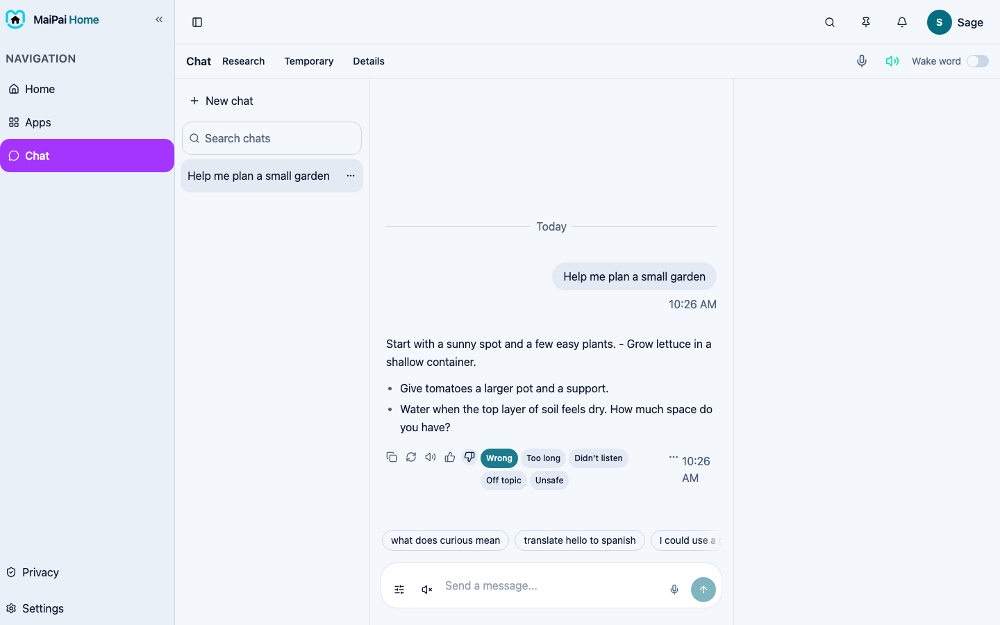
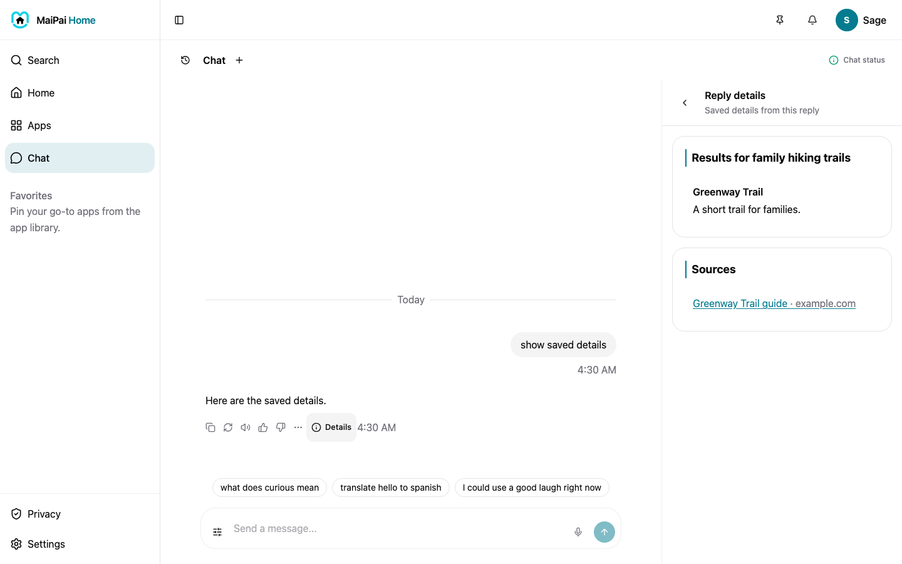
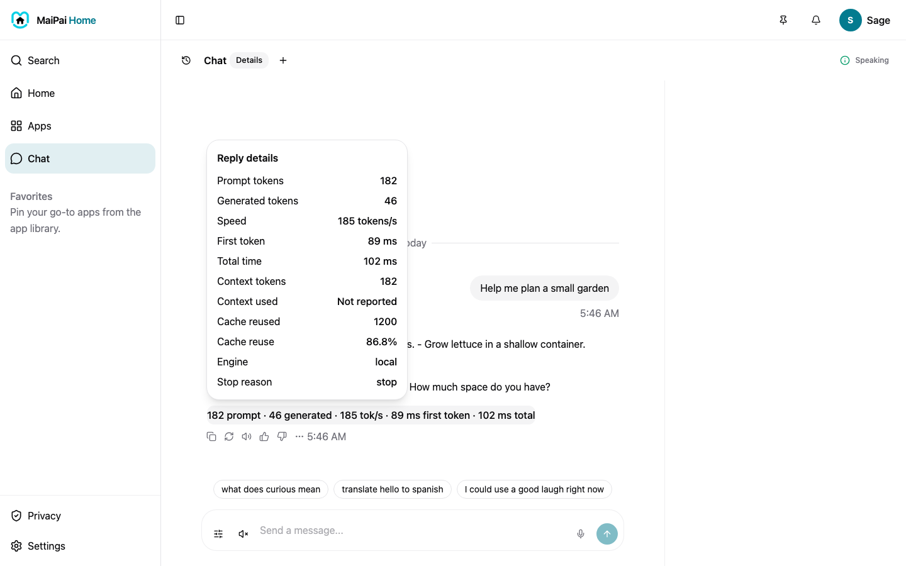
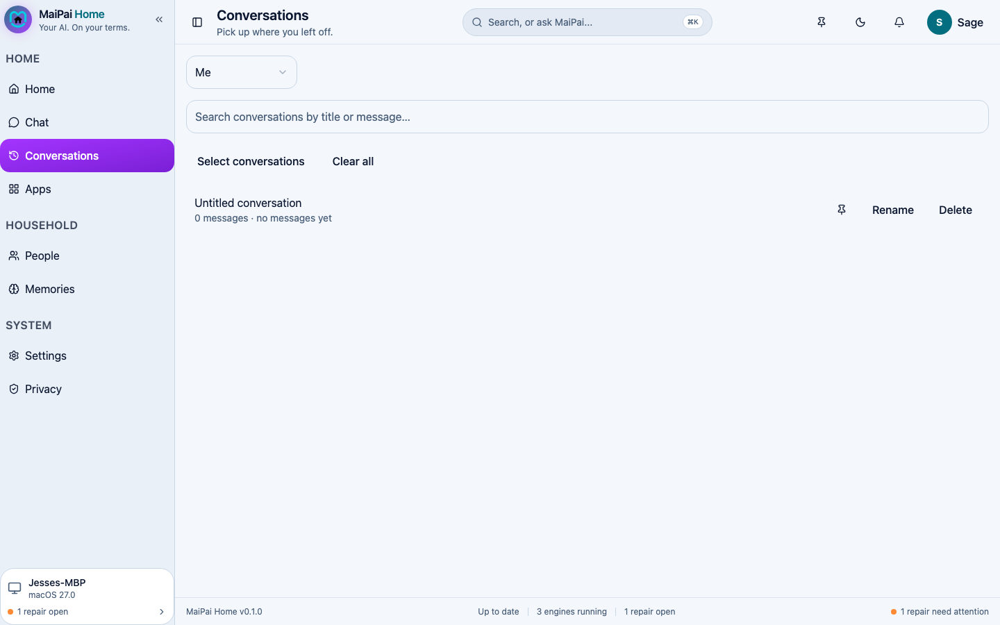
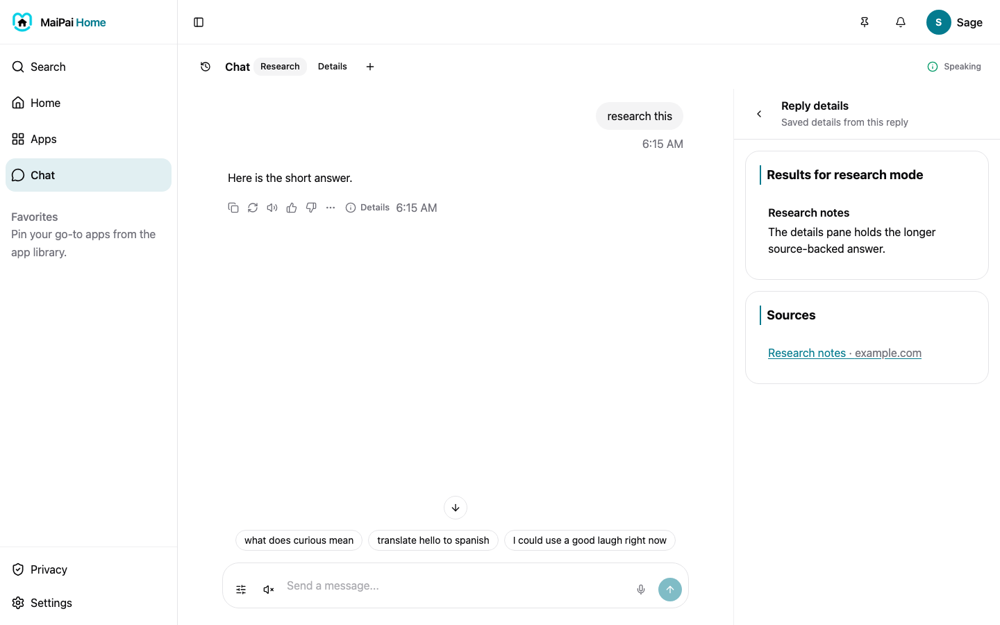
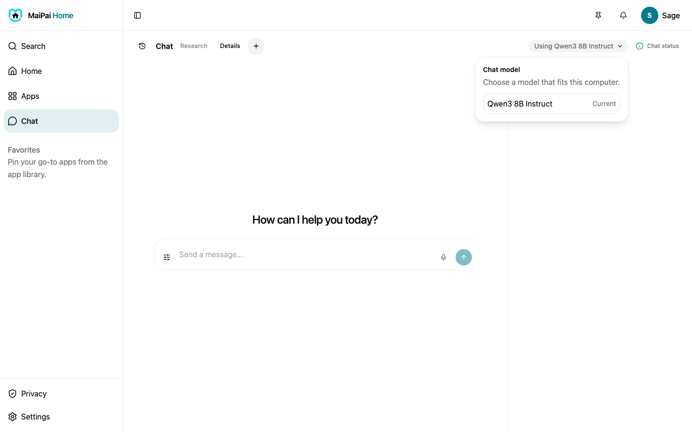
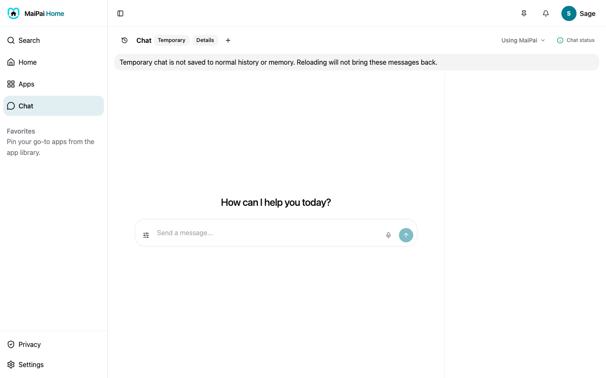
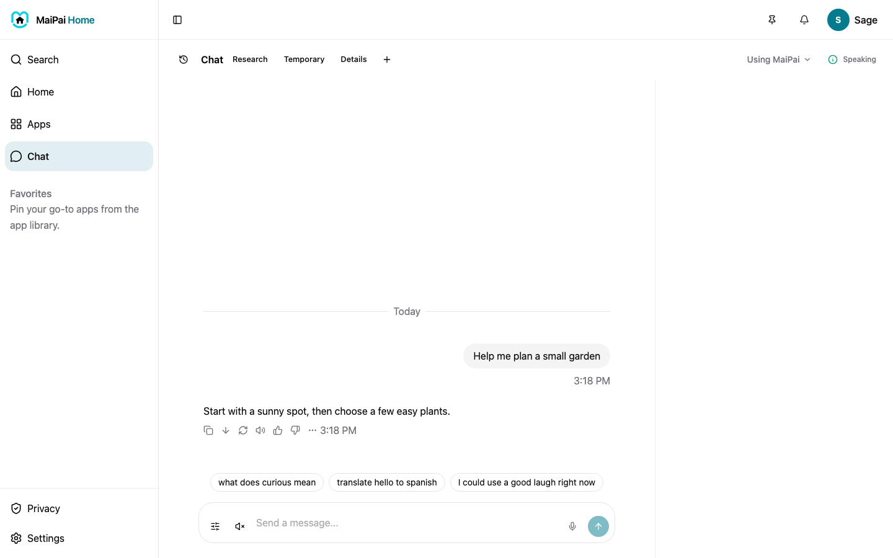

Chat is where you talk to MaiPai, by typing or by voice.

## Send a message

1. Tap the message box at the bottom and type your question.
2. Tap the arrow button, or press Enter, to send it.

MaiPai's answer appears right below your message.

## What MaiPai can look up

Ask MaiPai to look something up and you get a real answer, not a guess. Just ask it directly, for example:

- "What's the weather in Seattle?"
- "What does curious mean?"
- "Who directed Cobra?"
- "Search the web for tonight's game score"

Weather, word meanings, trivia, and film lookups work right away. Web search takes one more step. An adult sets it up first, in **Settings**.

See the [Privacy](privacy.md) page for what each one sends, and to whom.

When an answer comes from something MaiPai looked up, you'll see small numbered links under the reply, one per source. Tap a number in the text, or a link in the list, to open that page in a new tab. This way you can always check where an answer came from.

## Talk instead of type

Tap the microphone icon next to the message box and start speaking. MaiPai listens, turns your words into text, and sends it once you stop talking.

## Wake word (experimental)

Open **Chat status**, then tap **Wake word** to turn on the wake-word listener. This is an early, experimental feature. MaiPai can hear its wake word today, but it can't act on it yet. That's coming soon.

## Chat options and status

The small message box grows as you type. Open **Chat options** beside it to turn on **Think longer** for your next message.

Open **Chat status** to see the Brain, Mouth, Ears, and Eyes indicators. Each shows what is ready and what needs attention. Eyes is marked **Coming soon** until vision is available.

## More on a message

Each of MaiPai's replies has a few small buttons under it:

- **Copy** the text
- **Refresh** to get a new answer
- **Listen**, to have MaiPai read the answer out loud
- **More**, for extra options like remembering or forgetting that exchange

## Rate a reply

Under each of MaiPai's replies, tap the **thumbs up** or **thumbs down** button. A thumbs down opens a row of five reasons. Pick the one that fits, or tap elsewhere to close it.

A rating only labels the reply for the household. It does not change the answer or start a new one. MaiPai and the hub use those labels to see which kinds of replies land well.

## Open the details pane

Some replies come from a lookup, like the weather or a word meaning. Under that reply is a **Details** handle. Tap it and the full answer opens beside the chat, with the sources listed. On a phone the pane slides up from the bottom instead.

## See the reply stats

Beside the **Chat** title, tap **Details** to turn on the reply stats. Under each of MaiPai's replies, a small line appears with the token counts and the timing, for example how long the first token took and how fast the reply streamed. Tap the line to open the full set of numbers. Tap **Details** again to turn them off.

The setting is off by default, and children do not see the stats at all.

## Attach a document or picture

Tap the **+** button next to the message box, choose a document or a picture from your device, and it appears as a small tile above the box. Type your question, then send. MaiPai reads the file and answers about it.

The file stays on the hub, attached to that conversation, and it is deleted on the same schedule as the conversation. A child's picture follows the same rules as everything else they see: the answer stays within the child band, and the source links stay hidden.

Your own messages have buttons too. Hover or tap one to see **Copy**, **Edit**, and a brain icon for **Remember this**. Editing sends a new version and gets a fresh reply. MaiPai keeps both the old and new versions. A small **1 / 2** switcher lets you flip between them, even after you reload the page.

Did MaiPai save something you said? A **Memory updated** chip shows up under its reply. Tap the chip to see what was saved, on the [Memory](memory.md) page.

## Start a new conversation

Tap the **+** button beside Chat to start fresh. A new chat is saved when you send its first message.

## Your conversation history

Tap the history button beside Chat to see your saved chats. Pick one to read it and keep talking. Reloading the page keeps that chat open.

Open **More options** beside a chat to rename or delete it. Deleting asks you to confirm first.

Open **Conversations** from navigation for bulk actions and parental oversight:

- Tap one of your chat titles to reopen it.
- Tap **Rename** to give it a clearer title.
- Tap **Delete** to remove one you don't need.
- Tap **Select conversations** to choose several at once, or **Clear all** to remove everything.

At the top of that page, type in the search box to find a chat by its title or what you talked about in it. Tap the pin next to a chat to pin it to the top of the list, and tap it again to unpin it.

Owners and admins can also view another household member's conversations from this page. This helps with parental oversight.

## Research mode

Beside the **Chat** title, tap **Research** to turn on research mode for that conversation. While it is on, MaiPai looks everything up and opens the full answer in the details pane for each reply, so you can see the source. Tap it again to turn research mode off. The setting saves with the conversation, so it is still on when you come back.

## Choose the model

A model picker sits beside the **Chat** title. It shows the models you can use. The one in use is under the title, so a parent can see it right away. If a model is out of reach, the picker has one fix button. Children see a plain label, not model names.

## Temporary chat

Before you send your first message, turn on temporary mode. A banner above the chat says it's on. Those messages aren't saved, and reloading won't bring them back. The chat lasts for that session only, then it's gone.

## Continue a cut-off reply

If a reply cut off early, a **Continue** button appears under it. Tap it and MaiPai picks up where it stopped. The original reply stays the same. One tap makes one more call, then it's done.

## Still need help?

If Chat won't send a message or load a reply, see [Fix a problem](fix-a-problem.md).
