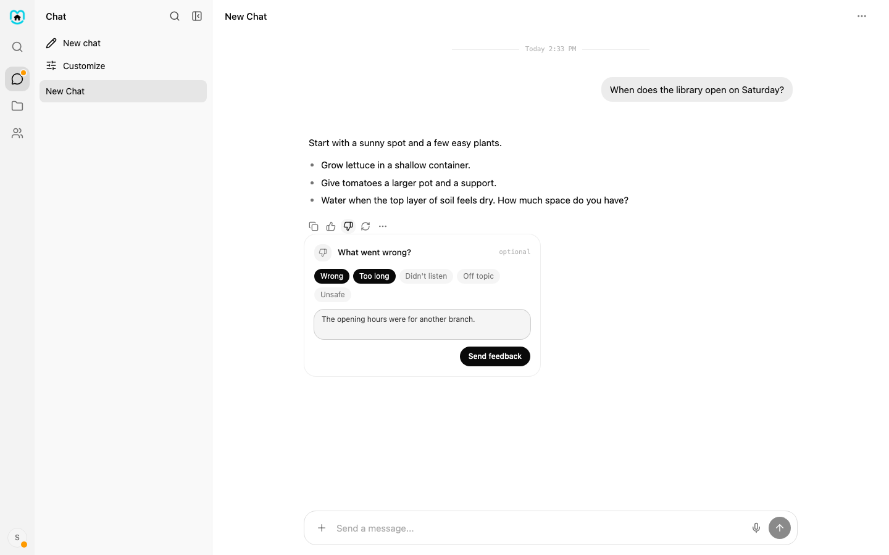
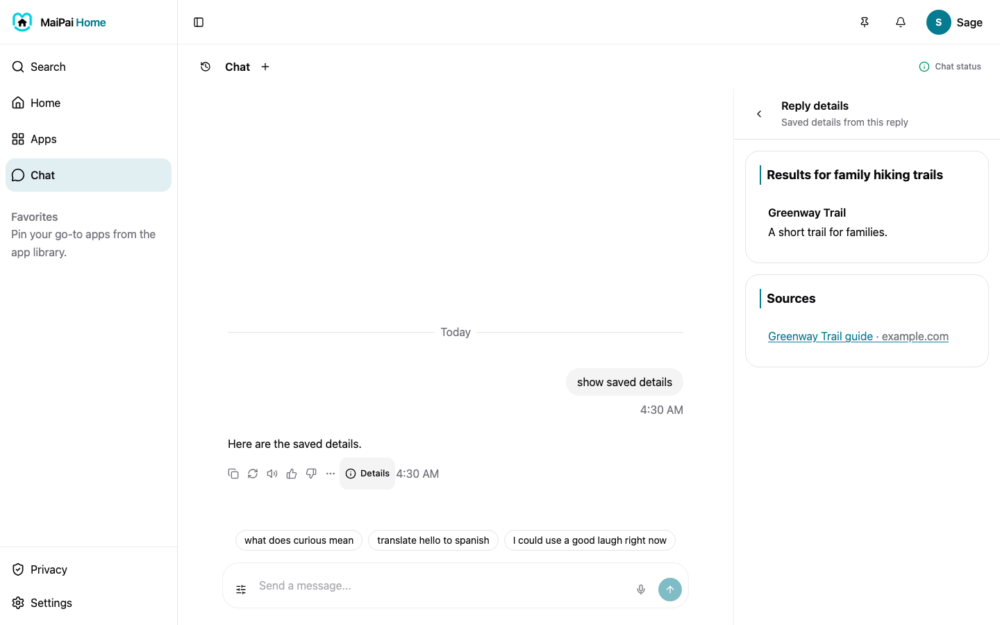
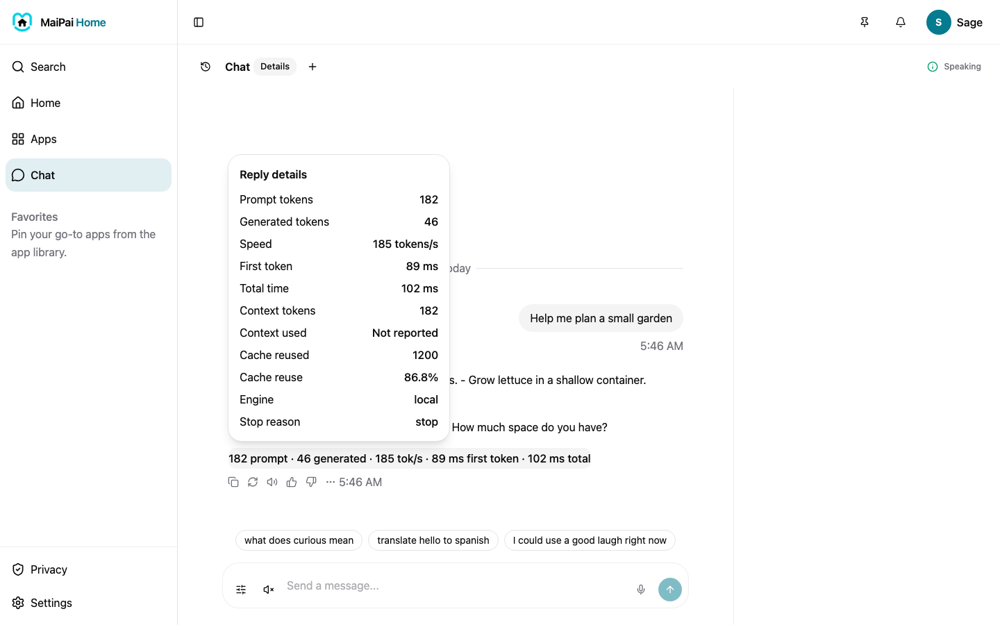
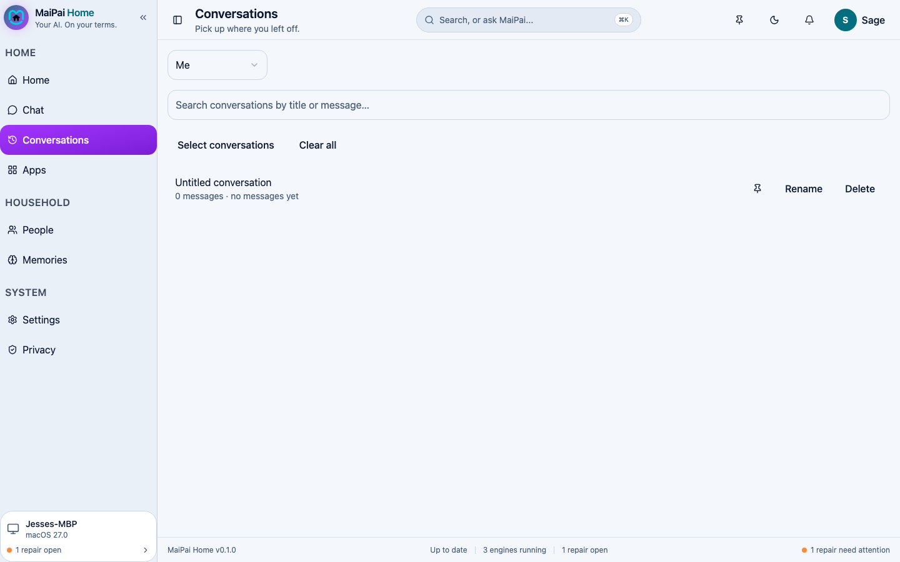
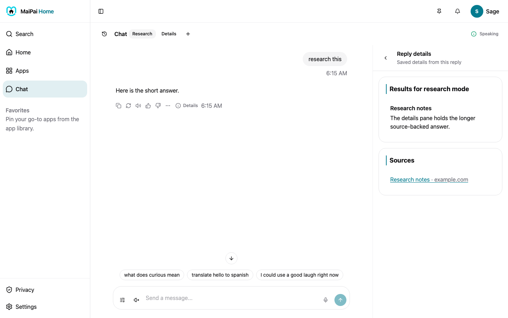
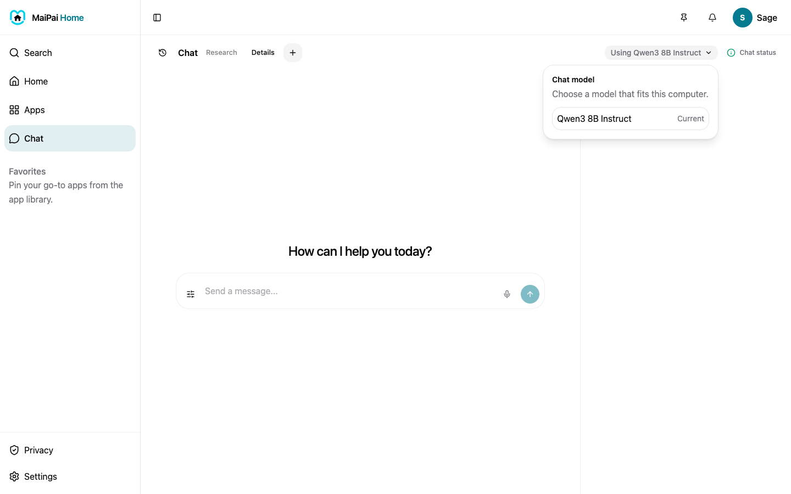
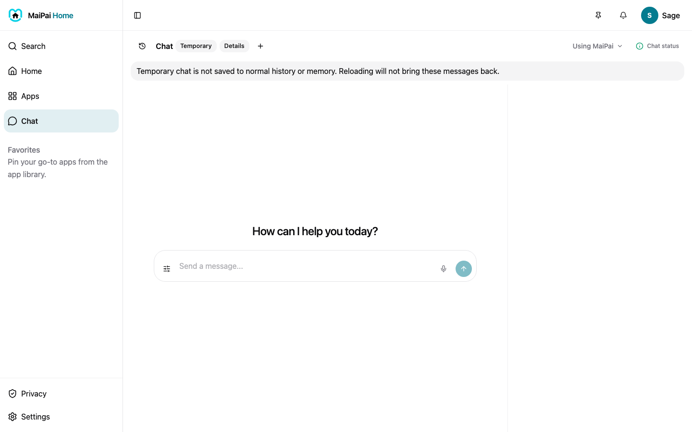
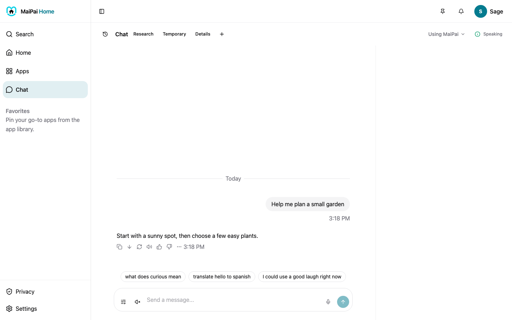

Chat is where you talk to MaiPai, by typing or by voice.

## Send a message

1. Tap the message box at the bottom and type your question.
2. Tap the arrow button, or press Enter, to send it.

MaiPai's answer appears below your message. Chat follows the newest text while a reply is coming in. If you scroll up, tap the down arrow to return to the latest message.

If you leave a chat while MaiPai is replying, the chat gets a title when you return. You do not need to wait for the reply to finish.

## What MaiPai can look up

Ask MaiPai to look something up and you get a real answer, not a guess. Just ask it directly, for example:

- "What's the weather in Seattle?"
- "What does curious mean?"
- "Who directed Cobra?"
- "Search the web for tonight's game score"

Weather, word meanings, trivia, and film lookups work right away. Web search takes one more step. An adult sets it up first, in **Settings**, **AI & connections**, **Integrations**, by adding the address of your own search server. When you search, MaiPai reads a few of the pages it finds, so the answer comes from what they say.

See the [Privacy](privacy.md) page for what each one sends, and to whom.

Some answers include small numbered markers such as **[1]** in the reply. Tap a marker to open the matching source. Choose **Sources** under the reply to see its source list.

## Save a draft

If you type in a saved chat and leave before sending, Chat keeps your draft on this device. Open that chat again and choose **Restore** to put the text back, or **Discard** to remove it. Sending the message clears the draft. Drafts are not saved in Incognito.

## If the AI is starting

If you see **Starting your AI**, wait for it to finish. You can type while it starts. The send button works again once it's ready.

## If the connection drops

Chat shows a banner when it is reconnecting, when the reply resumes, or when the connection is dropped. If the reply does not resume, choose **Retry** in the banner.

If a reply fails, one short line appears under it. Choose **Retry** to try the reply again. Admins can open **Error details** for more information.

## If chat is paused

Sometimes MaiPai's AI stops for a while, for example while the computer restarts it. A short line under the message box says chat is paused, and the top bar shows **Chat paused**. You can keep typing. The send button waits until chat is back, and your message stays in the box. If you look after the household, the line has an **Open Repairs** link that shows what stopped.

## Talk instead of type

Tap the microphone icon next to the message box and start speaking. MaiPai listens, turns your words into text, and sends it once you stop talking.

## Wake word (experimental)

Open **Chat status**, then tap **Wake word** to turn on the wake-word listener. This is an early, experimental feature. MaiPai can hear its wake word today, but it can't act on it yet. That's coming soon.

## Chat options and status

The message box grows as you type. Open **Chat options** beside it to turn on **Think longer** for your next message.

Open **Chat status** to see the Brain, Mouth, Ears, and Eyes indicators. Each shows what is ready and what needs attention. Eyes is marked **Coming soon** until vision is available.

## More on a message

Each of MaiPai's replies has a few small buttons under it:

- **Copy** the text
- **Refresh** to get a new answer
- **Listen**, to have MaiPai read the answer out loud
- **More**, for extra options like remembering or forgetting that exchange

## Rate a reply

Under each of MaiPai's replies, tap the **thumbs up** or **thumbs down** button. A thumbs down opens a row of five reasons. Pick the one that fits, or tap elsewhere to close it.

A rating only labels the reply for the household. It does not change the answer or start a new one. MaiPai and the hub use those labels to see which kinds of replies land well.

## Open the details pane

Some replies come from a lookup, like the weather or a word meaning. Under that reply is a **Details** handle. Tap it and the full answer opens beside the chat, with the sources listed. On a phone the pane slides up from the bottom instead.

## See the reply stats

Beside the **Chat** title, tap **Details** to turn on the reply stats. Under each of MaiPai's replies, a small line appears with the token counts and the timing, for example how long the first token took and how fast the reply streamed. Tap the line to open the full set of numbers. Tap **Details** again to turn them off.

The setting is off by default, and children do not see the stats at all.

## Attach a document or picture

Tap the **+** button next to the message box, choose a document or a picture from your device, and it appears as a small tile above the box. Type your question, then send. MaiPai reads the file and answers about it.

The file stays on the hub, attached to that conversation, and it is deleted on the same schedule as the conversation. A child's picture follows the same rules as everything else they see: the answer stays within the child band, and the source links stay hidden.

Your own messages have buttons too. Hover or tap one to see **Copy**, **Edit**, and a brain icon for **Remember this**. Editing sends a new version and gets a fresh reply. MaiPai keeps both the old and new versions. A small **1 / 2** switcher lets you flip between them, even after you reload the page.

Did MaiPai save something you said? A **Memory updated** chip shows up under its reply. Tap the chip to see what was saved, on the [Memory](memory.md) page.

## Start a new conversation

Tap **New chat** beside the chat list to start fresh. A new chat is saved when you send its first message.

## Long chats

A chat never stops working because it got long. As it grows, MaiPai keeps short notes about the earlier part and keeps the newest messages word for word. Rarely, a very long message will not fit beside those notes. MaiPai then says so and offers a fresh start: tap **New chat**, and the new chat brings the notes along. It uses them from your next message there. Talking to MaiPai out loud never gets this offer; it just answers.

## Your conversation history

Use the chat list beside the conversation to find a chat. Type in **Search chats** to search the list. On a narrow screen, open the chat list from its button. Use the collapse button to hide the list and make more room for the conversation. Reopen it from the same button.

Open **More options** beside a chat to rename or delete it. Deleting asks you to confirm first.

Open **Conversations** from navigation for bulk actions and parental oversight:

- Tap one of your chat titles to reopen it.
- Tap **Rename** to give it a clearer title.
- Tap **Pin** to keep it in the **Pinned** group. Tap **Unpin** to remove it from that group.
- Tap **Delete** to remove a chat you don't need.
- Tap **Select conversations** to choose several at once, or **Clear all** to remove everything.

Owners and admins can also view another household member's conversations from this page. This helps with parental oversight.

## Research mode

Beside the **Chat** title, tap **Research** to turn on research mode for that conversation. While it is on, MaiPai looks everything up and opens the full answer in the details pane for each reply, so you can see the source. Tap it again to turn research mode off. The setting saves with the conversation, so it is still on when you come back.

## Choose the model

A model picker sits beside the **Chat** title. It shows the models you can use. The one in use is under the title, so a parent can see it right away. If a model is out of reach, the picker has one fix button. Children see a plain label, not model names.

## Incognito

Turn on **Incognito** before you send a message. An Incognito chat is temporary and is not saved with your regular conversations. It has no saved title, cannot be pinned, and does not keep drafts. When you turn Incognito off, its chats are cleared.

## Continue a cut-off reply

If a reply cut off early, a **Continue** button appears under it. Tap it and MaiPai picks up where it stopped. The original reply stays the same. One tap makes one more call, then it's done.

## Still need help?

If Chat won't send a message or load a reply, see [Fix a problem](fix-a-problem.md).
