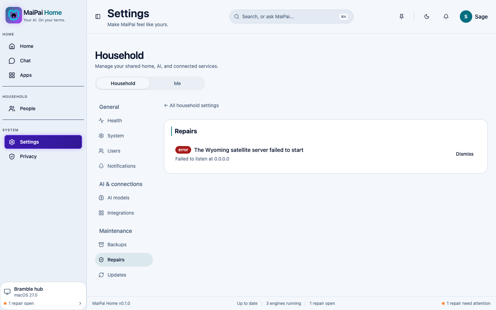

## Start here

Open **Settings**, then **Repairs** (under Household). MaiPai checks its own health here. It lists anything that needs attention, each with a button to fix it. This is the fastest way to find out what's wrong.

## If Chat won't send a message or answer

- Check Repairs first. MaiPai may have already spotted the problem.
- Make sure an AI model is set up. Open **Settings**, then **AI models**, and confirm one is selected.
- Try reloading the page.

## If voice input doesn't work

- Make sure your browser has permission to use your microphone.
- The wake word feature is experimental. It can hear its name today, but it can't act on it yet.

## If you can't sign in

- Double check your PIN or password.
- Ask an owner or admin to check your account. They can do this under **Settings** > **Users**, or reset your PIN there.
- If you're signed in on another device that's misbehaving, open **Settings**, then **Devices & sessions** (under Me), and sign that device out.

## If a setting won't save

- Check your internet connection to the hub itself. MaiPai still needs to reach your own server, even though nothing leaves your house.
- Only an owner or admin can change some settings. If a field looks disabled, that's likely why.

## Still stuck?

If Repairs shows nothing wrong, or none of the above helped, the MaiPai community can help you dig deeper. Check the developer documentation for how to reach us.
