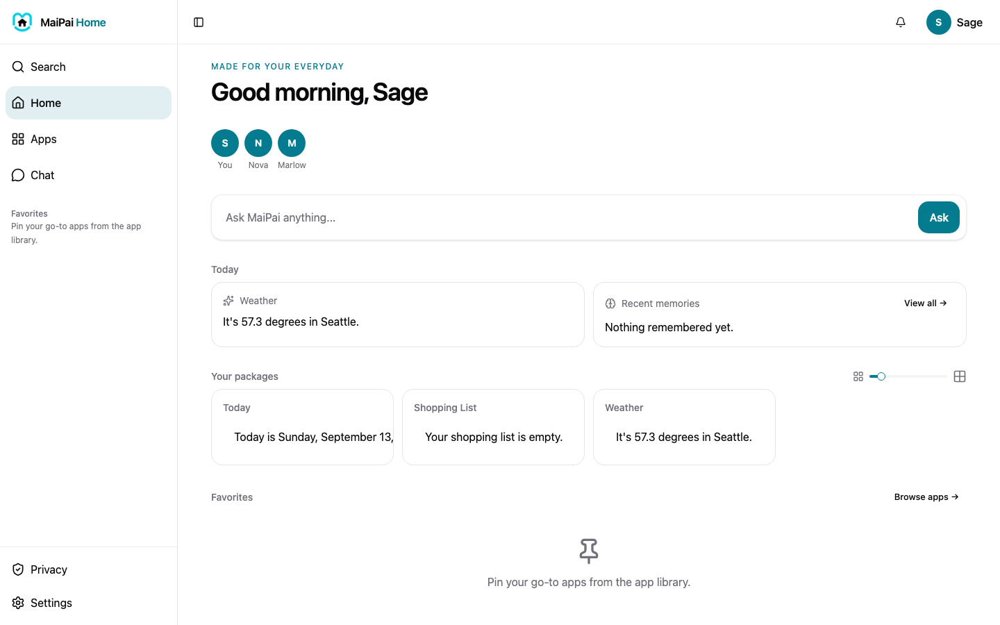

Home is the first thing you see when you open MaiPai. It's built to be glanceable: who's here, a quick question box, and a few cards for what's happening today.

## What's on the screen

- **Who's here.** A row of everyone in your household, so you can see who's set up on this hub.
- **Ask MaiPai anything.** Type a question here and MaiPai answers in Chat.
- **Today.** A couple of small cards, like the weather and anything MaiPai recently remembered for you.
- **Your packages.** Cards from any apps you've installed. Nothing here until you add some.
- **Your apps.** Shortcuts to your favorite pages. Pin an app from its own header to add it here.

## Ask a quick question

1. Tap the box that says **Ask MaiPai anything...**
2. Type your question.
3. Tap **Ask**.

MaiPai opens Chat and answers there, so the conversation is saved and you can keep talking.

## Pin an app to Home

Open any page (like People or Memory) and tap the pin icon in its header. It'll show up as a shortcut on Home the next time you visit.

