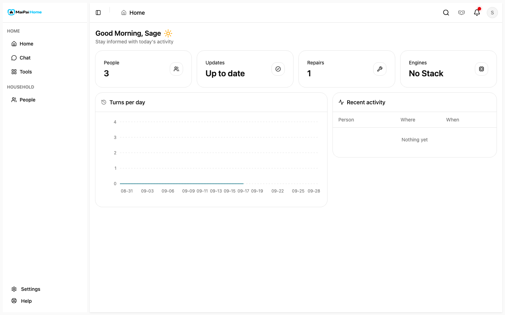

Home opens when you sign in. It shows how many people are in your home, any updates, open repairs, engines, usage, and recent activity.

## What's on the screen

- **Status cards.** See the number of people, updates, open repairs, and engine status.
- **Turns per day.** See how often people use MaiPai.
- **Recent activity.** See what has happened on this hub. It is empty when there is nothing to show.

## Start a conversation

Open **Chat** in the navigation to ask a question and continue the conversation there.

