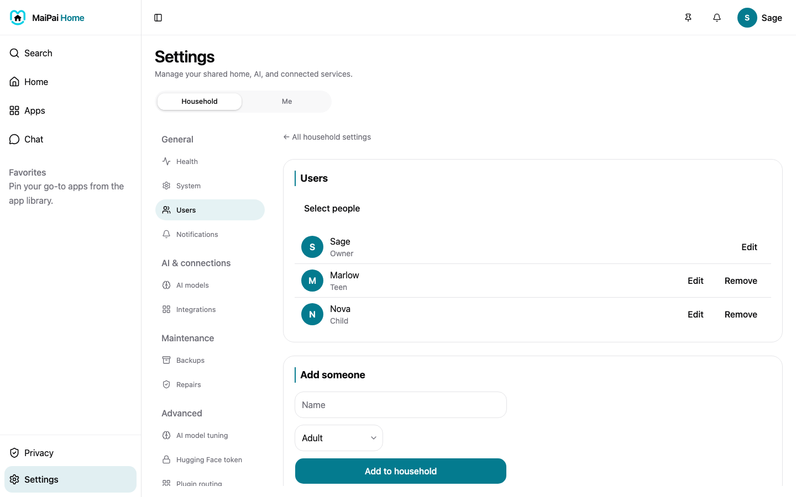

MaiPai keeps a separate profile for everyone in your household, each with its own conversations, memories, and access level.

## See who's in your household

Open **People** in the sidebar to see everyone with a profile on this hub, along with their role (Owner, Adult, Teen, or Child).

## Add, edit, or remove someone

Account management lives in Settings, not on the People page itself.

1. Open **Settings**, then **Users** (under Household).
2. To add someone, enter their name under **Add someone**, pick a role, and tap **Add to household**.
3. To change someone's role or details, tap **Edit** next to their name.
4. To remove someone, tap **Remove** next to their name. You can't remove the owner's own account.

Only an owner or admin can add, edit, or remove people.

## What each role can do

- **Owner**: full access to everything, including settings and every account.
- **Adult**: their own profile, full chat access.
- **Teen** and **Child**: a restricted profile by default. An adult unlocks more access for a specific person as your household needs it.

## Check in on a child's activity

As an owner or admin, you can view (never edit) what a child or teen has talked about and what MaiPai remembers about them:

- On the **Conversations** page, use the person picker at the top to switch to their conversations.
- On the **Memory** page, do the same to see what's been remembered for them, and forget anything you'd rather MaiPai not keep.

## Still need help?

If someone can't sign in, or you don't see the account options you expect, see [Fix a problem](fix-a-problem.md).
