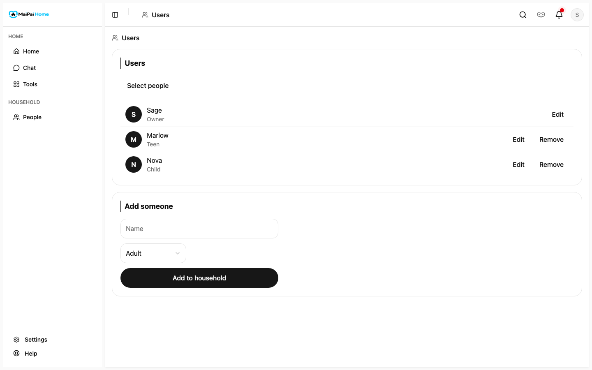

MaiPai keeps a profile for each person in your home. Each profile has its own chats, memories, and access level.

## See who's in your household

Open **People** in the sidebar. You'll see each person's name and role: Owner, Adult, Teen, or Child.

## Add, edit, or remove someone

Account management lives in Settings, not on the People page itself.

1. Open **Settings**, then **Users** under **Manage**.
2. To add someone, enter their name under **Add someone**, pick a role, and tap **Add to household**.
3. To change someone's role or details, tap **Edit** next to their name.
4. To remove someone, tap **Remove** next to their name. You can't remove the owner's own account.

Only an owner or admin can add, edit, or remove people.

### What happens to their files

When you remove someone, their pictures and other files go too, unless they shared them:

- A file nobody else could see is deleted with them.
- A file they shared with someone stays. The household keeps it, and it counts toward the household's storage, not anyone's own. It is listed as "Household, shared by" their name.
- Before you remove a child, you can tap **Download** to save their files first. A teen's or adult's own files are private, so ask them to save anything they want to keep before you remove them.

If you memorialize someone instead, every file they had stays exactly as it was.

## What each role can do

- **Owner**: full access to everything. This includes settings and every account.
- **Adult**: their own profile, with full chat access.
- **Teen** and **Child**: a restricted profile by default. An adult can unlock more access for them as your household needs it.

## Check in on a child's activity

Owners and admins can read a child's chats and memories. They cannot edit a child's chats.

- Open **Chat** to look at conversations. Open **People**, choose the child's profile, then choose **Memories** to see what MaiPai remembers. You can forget anything you'd rather MaiPai not keep.

If a child's chat worries MaiPai, adults get a note with the child's name. The note never says what was said. It cannot be turned off. Children are told that MaiPai may tell a grown-up.

## Still need help?

If someone can't sign in, or you don't see the account options you expect, see [Fix a problem](fix-a-problem.md).
