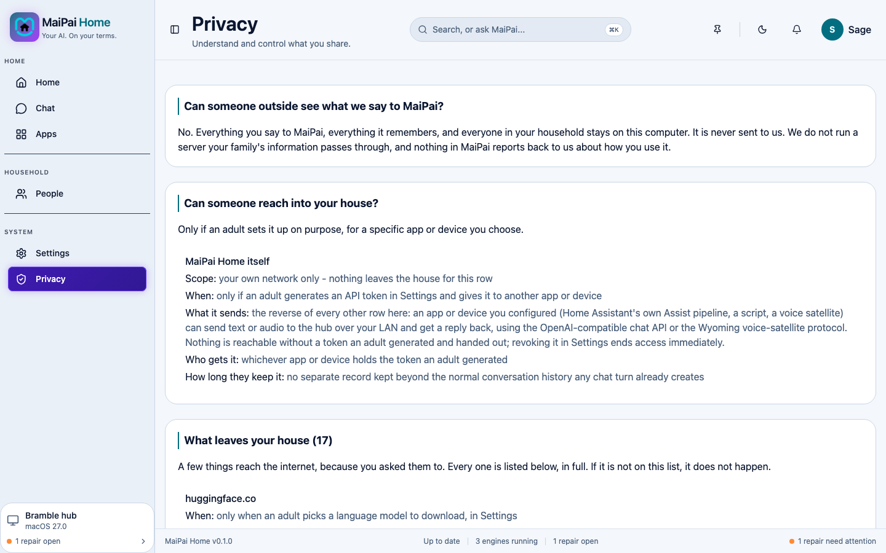

Everything you say to MaiPai, everything it remembers, and everyone in your household stays on this computer. It's never sent to us. MaiPai doesn't run a server your family's information passes through, and nothing reports back to us about how you use it.

## See what leaves your house

Open **Privacy** in the sidebar. It lists every single outbound connection MaiPai can make, and for each one:

- **When** it happens
- **What it sends**
- **Who receives it**
- **How long they keep it**

If something isn't on this list, it doesn't happen. Most entries only occur when an adult chooses to download a model or a voice in Settings, or when your household turns on an optional feature like weather or trivia.

## What never leaves your house

Your conversations, everything MaiPai remembers, and every profile in your household stay entirely on this computer. MaiPai doesn't collect usage statistics or crash reports, and nothing your family says is ever used to train anything.

## Still need help?

If something on this page looks unfamiliar or you're not sure why a connection is listed, see [Fix a problem](fix-a-problem.md).
