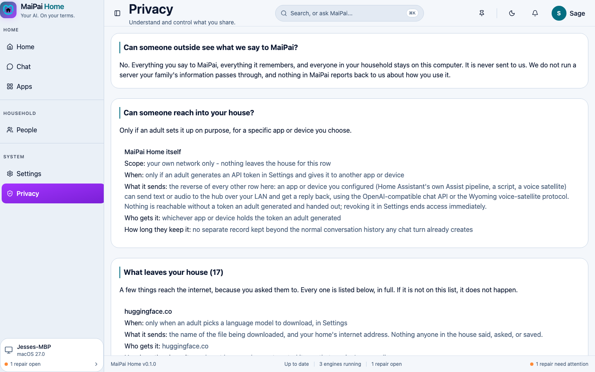

Your conversations, memories, and household profiles stay on this computer. MaiPai does not run a server that your family's information passes through, and nothing reports back to us about how you use it. A feature can send the small piece of information it needs directly to its own service, such as the place in a weather request or the word you want defined. The list below names every connection.

## See what leaves your house

Open **Settings**, then **Privacy**. It lists the connections MaiPai can make, including outbound services and inbound token access. For each one, you'll see:

- **When** it happens
- **What it sends**
- **Who receives it**
- **How long they keep it**

Anything not on this list does not happen. Most entries happen only when an adult chooses a download or turns on an optional feature. Other entries happen when someone asks for a service, such as weather, trivia, a joke, a definition, news, sports, music, web search, or a film or TV lookup. A web search sends the words you searched to the search server you chose. That server asks public search engines for results, so those engines see the words too. They do not get your name or address. Then MaiPai reads up to three of the pages it found, one from each site, so its answer comes from what the pages say. It asks each site for the page the way a web browser would. That site sees a page request from your home's internet address. It does not see your question. Search needs no key and no account. If your search server cannot be reached and **Ask Wikipedia when web search fails or finds nothing** is on, the words you searched go to Wikipedia instead. Wikipedia is run by the Wikimedia Foundation. Children's and teens' searches never use this fallback. You can turn this off in **Settings**, **Integrations**. For a child or a teen, MaiPai checks everything it reads before it is used, and drops anything that fails the check. When you ask what a web page says or ask for a page's link, the hub fetches that one page from its site. One daily check asks GitHub whether a new MaiPai Home release is available. One download happens on its own, with no one choosing it. The hub uses a small memory helper to decide what to remember and to write conversation summaries. The first time it needs that helper, it downloads a 2.5-gigabyte file from Hugging Face. Downloads send the file name and your home's internet address. They do not send anything anyone in the house said, asked, or saved.

Web search works with no key and no account. An adult can choose to add a Brave Search key under **Settings**, **Household**, **Integrations**. Then an adult's searches go to Brave Search, so the words searched leave your house. Nothing else goes with them. A child's or teen's searches never go there, even with a key saved. The key is stored encrypted and can't be read back. Clear it to go back to searching with no key. The list above shows this row only while a key is saved.

When a robot is paired, MaiPai downloads its pinned robot models directly from their listed public release hosts. The hub verifies each file against its SHA-256 pin and serves the verified bytes to the robot over your home network. The download sends only the file name and your home's internet address.

When a written answer includes pictures, Home gets a few picture files from the sites that host them. The picture requests do not send your name or what you asked. Home does not send cookies or the page you came from. Wikipedia and Wikidata get the name of the person or thing when Home checks their picture sources. The sites receive your home's internet address. Nothing else anyone in the house said or saved is sent.

An adult can also generate an API token for another app or device. This page shows that too, under its own heading. It is the one thing that goes the other way: an app or device you gave the token to can send text or audio to your hub over your home network and receive a reply. Revoking the token ends that access.

## What never leaves your house

Your conversations stay on this computer. So does everything MaiPai remembers, and every profile in your household. MaiPai does not collect usage stats or crash reports. Nothing your family says is used to train anything. Your browser saves a copy of MaiPai's own screens on this device so the app can still open without internet. That cache is same-origin only: it stores the app's own files, never anything you typed or anything MaiPai remembers.

Adults can mark one chat as temporary. We do not add its turns to normal history or long-term memory. If you open that chat again, the old turns do not return. This only covers MaiPai on this computer. An optional remote service may keep its own copy. See the list above.

When a child's conversation seems to weigh on them, the adults get a note saying so, with the child's name only, never what was said. This notice cannot be turned off.

## Still need help?

Something on this page can look unfamiliar. You might not be sure why a connection is listed. Either way, see [Fix a problem](fix-a-problem.md).
