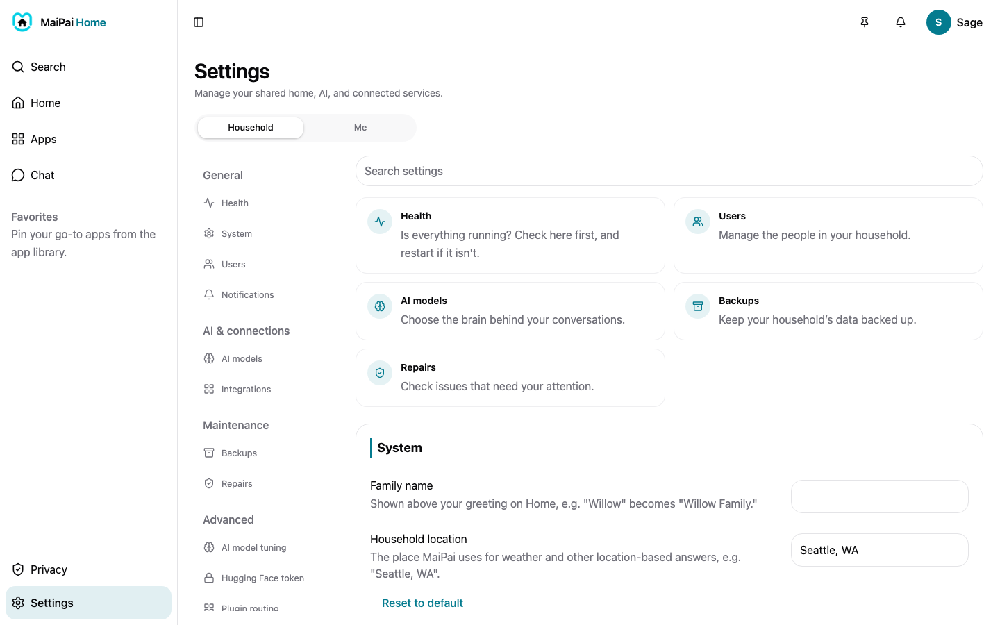

Settings are split into two tabs at the top of the page. **Household** holds shared settings, usually owner or admin only. **Me** holds your own personal preferences.

## Household settings

- **Health**: the first thing on the page. It tells you whether MaiPai's brain, understanding, and voice are running right now, checked live. If one has stopped, MaiPai starts it again on its own. If it keeps stopping, a note appears in Repairs. The Restart server button is here too.
- **System**: your household's language and region. Also how long backups and conversation history are kept.
- **AI model tuning**, **Integrations**, **Notifications**, **Hugging Face token**: advanced options for MaiPai's models and connections.
- **Users**: add, edit, or remove household members. See [People and parental controls](people.md).
- **AI models**: choose which AI model MaiPai uses for chat and other tasks.
- **Backups**: run a backup now, or see your backup history.
- **Repairs**: MaiPai's own health check. Anything that needs attention shows up here with a fix you can apply.
- **Plugin routing**: see how MaiPai matches your requests to its built-in skills.

## Your own settings

Switch to the **Me** tab for your own personal preferences:

- **Appearance**, **Personality**, **Voice**: how MaiPai looks and sounds when it talks to you.
- **My notifications**: how you're notified. This includes linking your own Telegram chat.
- **Voices**: browse and pick a speaking voice, or clone your own.
- **PIN / password**: change how you sign in.
- **Commands**: teach MaiPai a phrase of your own. For example, "when I say movie night, dim the lights."
- **Devices & sessions**: see what's signed in as you. Sign out anything you don't recognize.

## Find a setting fast

Use the **Search settings** box at the top of the page. It jumps you straight to what you're looking for.

## Still need help?

If a setting won't save, or you can't find one you expect, see [Fix a problem](fix-a-problem.md).
