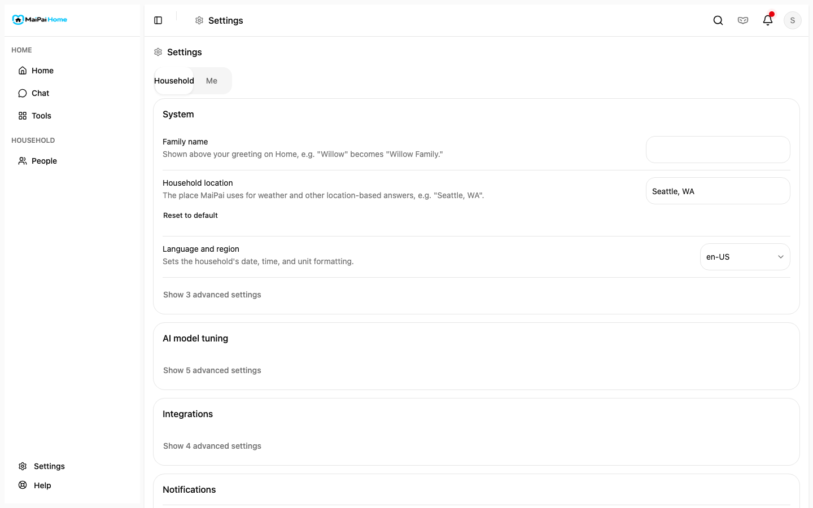

Settings are split into two tabs at the top of the page. **Household** holds shared settings, usually owner or admin only. **Me** holds your own personal preferences.

## Household settings

- **System**: your household's language and region. Also how long backups and conversation history are kept.
- **AI model tuning**, **Integrations**, **Notifications**, **Hugging Face token**: advanced options for MaiPai's models and connections.

Under **Manage**, open **Users** to add, edit, or remove household members; **AI models** to choose models; **Backups** to run or review backups; **Repairs** to check and fix issues; **Updates** to see what is available; and **Privacy** to review connections. See [People and parental controls](people.md) for account details.

## Your own settings

Switch to the **Me** tab for your own personal preferences:

- **Appearance**, **Personality**, **Voice**: how MaiPai looks and sounds when it talks to you.
- **Look**: pick the color scheme of the whole app. Neutral is the standard look, black and white, the same as the design it comes from. Navy is MaiPai's own blue-black set. The other six are ready-made color sets (Stone, Zinc, Mauve, Olive, Mist, Taupe). Light and dark mode both follow whichever one you pick.
- **On this device only**: choose a light, dark, or system appearance for this browser. This device choice takes precedence over your personal Appearance setting; reset it to use your personal setting again. It is stored only in this browser and is not synced.
- **My notifications**: how you're notified. This includes linking your own Telegram chat.
- **Voices**: browse and pick a speaking voice, or clone your own.
- **PIN / password**: change how you sign in.
- **Your name**: change the name MaiPai calls you. It shows on your messages everywhere.
- **Commands**: teach MaiPai a phrase of your own. For example, "when I say movie night, dim the lights."
- **Devices & sessions**: see what's signed in as you. Sign out anything you don't recognize.

## Find a setting fast

Use the **Search settings** box at the top of the page. It jumps you straight to what you're looking for.

## Still need help?

If a setting won't save, or you can't find one you expect, see [Fix a problem](fix-a-problem.md).
